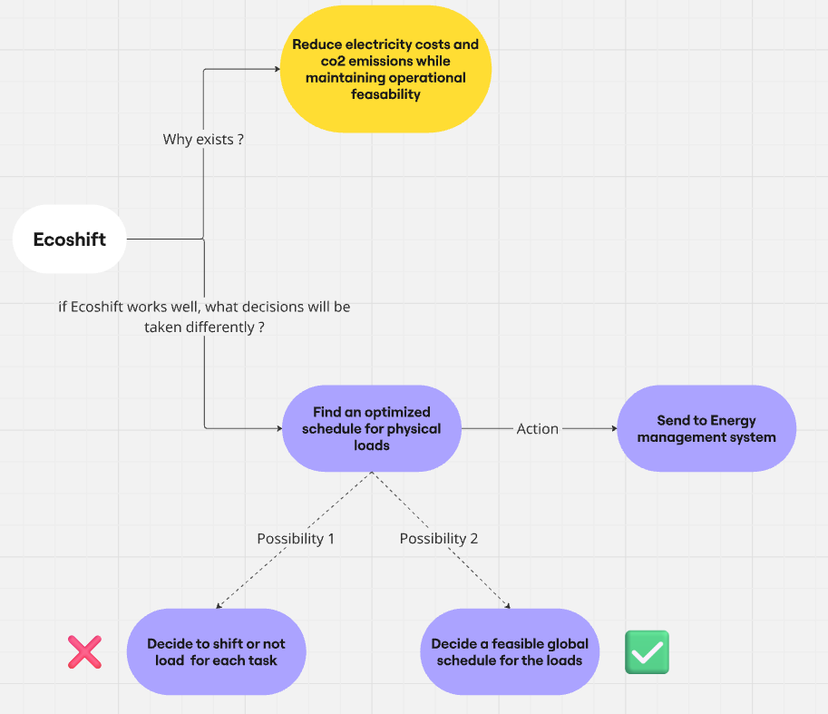

# PROBLEM FRAMING FIRST VERSION V1

## MAIN GOAL 

### Evaluating the Decision Regret of a Predict-then-Optimize solution under variable uncertainty (electricity & co2)

## CONCEPT DIAGRAM

## OPEN QUESTIONS

**Q01 (Trade-off) :** How should EcoShift balance cost (€) vs emissions ($\text{CO}_2$) when their optima conflict?

**Q02 (Uncertainty) :** How should the optimizer react if forecast error exceeds 10% during execution?

## DOMAIN ASSUMPTIONS (V1)

**A01 Energy Completion :** Required energy $E_{\text{req}}$ must be fully delivered within $[t_{\text{start}}, t_{\text{deadline}}]$.

**A02 Continuous Power :** Power $p_t$ is continuously modulable in $[P_{\min}, P_{\max}]$.

**A03 Deterministic Input :** Forecasts for all 48 steps are fully available at $t=0$.

**A04 No Storage:** Energy consumed is directly used by the process (no local battery storage).

## DOMAIN FACTS (INVARIANTS)

**F01 (Temporal Discretization) :** Horizon $N = 24 hours = 48$ steps of 30 minutes ($\Delta t = 0.5\text{ h}$).

**F02 (Physical Relation) :** Energy $E_t\text{ (kWh)} = p_t\text{ (kW)} \times 0.5\text{ h}$.

**F03 (Unit Conversions) :** $1\text{ MWh} = 1000\text{ kWh}$ and $1\text{ kg} = 1000\text{ g}$.

## SCOPE & DECISION BOUNDARIES

### IN SCOPE (V1) :

- Single industrial load optimization
- 24-hour horizon (48 time-slots)
- Linear Progamming Optimization
- Manually choosen scalar trade-off $\alpha$ between electricty price and co2 emissions 

### OUT OF SCOPE (Future Version)

- Multi-asset / multi-factory joint optimization
- Multi-day or seasonal energy storage 
- Stochastic optimization (uncertainty propagation)
- Scalar trade-off via parameter Dynamic Pareto frontier generation